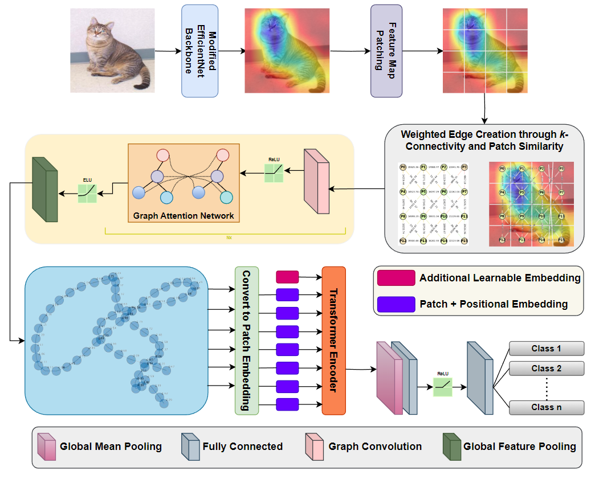

### Model Description

Implementation of the ***SAG-ViT*** model as proposed in the [SAG-ViT: A Scale-Aware, High-Fidelity Patching Approach with Graph Attention for Vision Transformers](https://arxiv.org/abs/2411.09420) paper. 

It is a novel transformer framework designed to enhance Vision Transformers (ViT) with scale-awareness and refined patch-level feature embeddings. It extracts multiscale features using EfficientNetV2 organizes patches into a graph based on spatial relationships, and refines them with a Graph Attention Network (GAT). A Transformer encoder then integrates these embeddings globally, capturing long-range dependencies for comprehensive image understanding.

### Model Architecture

<p align="center">
    
</p>

_Image source: [SAG-ViT: A Scale-Aware, High-Fidelity Patching Approach with Graph Attention for Vision Transformers](https://arxiv.org/abs/2411.09420)_

### Usage

SAG-ViT expect input images normalized in the same way,
i.e. mini-batches of 3-channel RGB images of shape `(N, 3, H, W)`, where `N` is the number of images, `H` and `W` are expected to be at least `49` pixels.
The images have to be loaded in to a range of `[0, 1]` and then normalized using `mean = [0.485, 0.456, 0.406]`
and `std = [0.229, 0.224, 0.225]`.

To train or run inference on our model, you will need to install the following Python packages. 

```bash
pip install -q torch-geometric==2.6.1 networkx==3.3 torch==2.4.0 torchvision==0.19.0 scikit-learn==1.2.2 numpy==1.26.4 pandas==2.2.3 matplotlib==3.7.5 
```

Load the model pretrained on CIFAR-10 dataset.
```python
import torch

# Load the SAG-ViT model
model = torch.hub.load('shravan-18/SAG-ViT', 'SAGViT', pretrained=True)
# Change to eval mode for prediction
model.eval()
```

Sample execution to predict on an input image. 
```python
from PIL import Image
import torch

def predict_image(model, img_tensor, device='cpu'):
    """
    Predicts the class label for the given image tensor.
    """
    with torch.no_grad():
        img_tensor = img_tensor.to(device)
        outputs = model(img_tensor)
        probs = torch.softmax(outputs, dim=1)
        _, preds = torch.max(probs, 1)
        return preds.item(), probs[0, preds.item()].item()

# Set input image path to predict
image_path = "path/to/input/image"

# Preprocess the input image
transform = transforms.Compose([
        transforms.Resize((224, 224)),
        transforms.ToTensor(),
        transforms.Normalize(mean=[0.485, 0.456, 0.406],
                             std=[0.229, 0.224, 0.225])
    ])
img = Image.open(image_path).convert("RGB")
img_tensor = transform(img)
img_tensor = img_tensor.unsqueeze(0) # Add batch dimension

# Predict
pred_class, confidence = predict_image(model, img_tensor, device)

# CIFAR-10 label mapping
class_names = [
    'airplane', 'automobile', 'bird', 'cat', 'deer',
    'dog', 'frog', 'horse', 'ship', 'truck'
]

predicted_label = class_names[pred_class]
print(f"Predicted class: {predicted_label} with confidence: {confidence:.4f}")
```

### Running Tests

If you clone our [repository](https://github.com/shravan-18/SAG-ViT), the *'tests'* folder will contain unit tests for each of our model's modules. Make sure you have a proper Python environment with the required dependencies installed. Then run:
```bash
python -m unittest discover -s tests
```

or, if you are using `pytest`, you can run:
```bash
pytest tests
```

### Results

We evaluated SAG-ViT on diverse datasets:
- **CIFAR-10** (natural images)
- **GTSRB** (traffic sign recognition)
- **NCT-CRC-HE-100K** (histopathological images)
- **NWPU-RESISC45** (remote sensing imagery)
- **PlantVillage** (agricultural imagery)

SAG-ViT achieves state-of-the-art results across all benchmarks, as shown in the table below (F1 scores):

<center>

| Backbone           | CIFAR-10 | GTSRB  | NCT-CRC-HE-100K | NWPU-RESISC45 | PlantVillage |
|--------------------|----------|--------|-----------------|---------------|--------------|
| DenseNet201        | 0.5427   | 0.9862 | 0.9214          | 0.4493        | 0.8725       |
| Vgg16              | 0.5345   | 0.8180 | 0.8234          | 0.4114        | 0.7064       |
| Vgg19              | 0.5307   | 0.7551 | 0.8178          | 0.3844        | 0.6811       |
| DenseNet121        | 0.5290   | 0.9813 | 0.9247          | 0.4381        | 0.8321       |
| AlexNet            | 0.6126   | 0.9059 | 0.8743          | 0.4397        | 0.7684       |
| Inception          | 0.7734   | 0.8934 | 0.8707          | 0.8707        | 0.8216       |
| ResNet             | 0.9172   | 0.9134 | 0.9478          | 0.9103        | 0.8905       |
| MobileNet          | 0.9169   | 0.3006 | 0.4965          | 0.1667        | 0.2213       |
| ViT - S            | 0.8465   | 0.8542 | 0.8234          | 0.6116        | 0.8654       |
| ViT - L            | 0.8637   | 0.8613 | 0.8345          | 0.8358        | 0.8842       |
| MNASNet1_0         | 0.1032   | 0.0024 | 0.0212          | 0.0011        | 0.0049       |
| ShuffleNet_V2_x1_0 | 0.3523   | 0.4244 | 0.4598          | 0.1808        | 0.3190       |
| SqueezeNet1_0      | 0.4328   | 0.8392 | 0.7843          | 0.3913        | 0.6638       |
| GoogLeNet          | 0.4954   | 0.9455 | 0.8631          | 0.3720        | 0.7726       |
| **Proposed (SAG-ViT)** | **0.9574** | **0.9958** | **0.9861** | **0.9549** | **0.9772** |

</center>

### Ablation

In our ablation study on the CIFAR-10 dataset, we examined the impact of each component in our model. Removing the Transformer encoder while keeping the EfficientNet backbone and GAT resulted in a drop in the F1 score to 0.7785, highlighting the importance of the Transformer for capturing global dependencies. Excluding the GAT while keeping the EfficientNet backbone and Transformer encoder led to an F1 score of 0.7593, emphasizing the role of the GAT in refining local feature representations. When the EfficientNet backbone was removed, leaving only the GAT and Transformer encoder, the F1 score drastically decreased to 0.5032, demonstrating the critical role of EfficientNet in providing rich feature embeddings. The ablation results are summarized in the table below.

<center>

| **Model**                                 | **F1**   | **RAM (GB)** | **GPU (VRAM) (GB)** | **Time per Epoch**   |
|-------------------------------------------|----------|--------------|---------------------|----------------------|
| Backbone + GAT (no transformer)          | 0.7785   | 5.6          | 4.9                 | 14 mins 30 sec       |
| Backbone + transformer (no GAT)          | 0.7593   | 3.1          | 4.5                 | 16 mins 7 sec        |
| GAT + Transformer (no Backbone)          | 0.5032   | 4.3          | 5.3                 | 1 hour 33 mins       |

</center>

## Citation

If you find our [paper](https://arxiv.org/abs/2411.09420) and [code](https://github.com/shravan-18/SAG-ViT) helpful for your research, please consider citing our work and giving the repository a star:

```bibtex
@misc{SAGViT,
      title={SAG-ViT: A Scale-Aware, High-Fidelity Patching Approach with Graph Attention for Vision Transformers}, 
      author={Shravan Venkatraman and Jaskaran Singh Walia and Joe Dhanith P R},
      year={2024},
      eprint={2411.09420},
      archivePrefix={arXiv},
      primaryClass={cs.CV},
      url={https://arxiv.org/abs/2411.09420}, 
}
```
